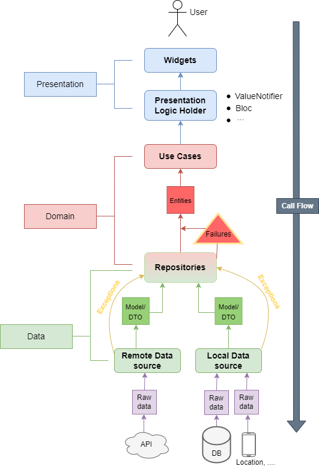

# Proposta de Arquitetura

É um projeto básico e contínuo [flutter](https://flutter.dev) para salvar e apresentar minha proposta de arquitetura limpa.

## Visão geral

Bom, essa proposta foi baseada na [Proposta do Reso Coder](https://resocoder.com/flutter-clean-architecture-tdd/) e na [Proposta do Flutterando](https://github.com/Flutterando/Clean-Dart) . Fiz algumas alterações/melhorias em ambas as propostas considerando algumas necessidades, e claro, respeitando os princípios SOLID e o Clean Code.

Você pode ver um projeto de exemplo com esta arquitetura clicando [aqui](https://github.com/Juniorlpes/todo-list-app).

## Explicar

Aqui está a proposta de arquitetura limpa do tio Bob

Observe que as divisões e as setas representam o fluxo da dependência.

Sigo o [Reso Coder](https://resocoder.com/) dividindo os recursos em três camadas conforme o diagrama:

Todas as características da minha proposta seguem as divisões do diagrama.

Em minha proposta tentei simplificar uma grande quantidade de pastas e arquivos para evitar redundância, mas sem querer os princípios, mantendo alta coesão e baixo acoplamento.

Falando em baixo acoplamento, a classe RestService é a abstração de um pacote para requisições http, ela conhece o pacote externo e todas as fontes de dados dependem dele, então se o pacote para requisições for substituído, apenas esta classe terá que ser alterada.

## Pastas

Agora vou explicar a organização das pastas.

Na raiz do projeto (pasta lib) coloquei três pastas, features, core e shared.

A pasta <strong>core</strong> é para colocar classes "imutáveis". Classes que você não usará com frequência em seu trabalho de desenvolvimento.  
Ex: configuração do ambiente, abstração de serviços globais etc.

A pasta <strong>shared</strong> é para colocar arquivos compartilhados para todo o projeto. 
Ex: enums, entidades, extensões, constantes etc.

A pasta <strong>features ou modules</strong> serve para colocar todas as features do projeto. 
<strong>Obs:</strong> Cada módulo será dividido em outras três pastas referentes às três camadas mostradas acima na imagem.

## Camadas

As três camadas são: <strong>domain</strong>, <strong>data</strong> e <strong>presenter</strong>.

O <strong>domain</strong> contém todas as regras de negócios. Diz <strong>o que</strong> o módulo faz.

A camada <strong>data</strong> informa <strong>como</strong> o módulo executa suas tarefas.  
Toda implementação, conexão é feita nesta camada.

<strong>Observe que:</strong> O repositório na imagem/diagrama pertence ao domínio e à camada de dados, portanto a abstração está no domínio, mas sua implementação é feita nos dados.  
Eu uso a implementação do repositório para lidar com possíveis erros de fonte de dados.

Por fim, a camada <strong>presenter</strong> cuida da exibição, dos widgets e da lógica da view. Ele conhece apenas os casos de uso do módulo.

## Voce pode ver um projeto real de exemplo no meu [Todo list App](https://github.com/Juniorlpes/todo-list-app)