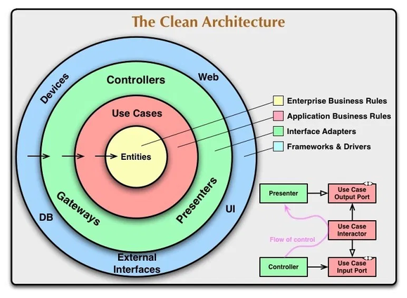

# Architecture Proposal

It is a basic and continuous [flutter](https://flutter.dev) project to save and present my clean architecture proposal

## Overview

Well, this proposal was based on [Reso Coder Proposal](https://resocoder.com/flutter-clean-architecture-tdd/) and [Flutterando proposal](https://github.com/Flutterando/Clean-Dart). I did some changes/improvements in both proposal considering some necessities, and of course, respecting the SOLID principles and the Clean Code.

This project has two branchs. 
The base-proposal branch is the clean proposal, it's just used only Dart/Flutter code without any external package, except the [dartz](https://pub.dev/packages/dartz) package that only provide useful dart classes. (see [Either](https://pub.dev/documentation/dartz/latest/dartz/Either-class.html) class)
The [...] branch is a "real world branch" where I use some external packages to support our daily development work, highlighting the [flutter_modular](https://pub.dev/packages/flutter_modular) package that manages the app's routes and binds, separating the features into modules like the Angular framework (Javascript).

## Explain

Here is the Uncle Bob's Clean Architecture Proposal

Look for the divisions and the arrows representing the dependency flow.

I follow the [Reso Coder](https://resocoder.com/) dividing the features in three layers according the diagram:

All features in the proposal follow the diagram's divisions.

A big difference between my proposal and the two anothers typed on overview (has some little changes I'll not explain here) is the WebService class I putted on app's core (shared folder). This class is important because it will contains the external package injected into it to offers basic operations to app get remote data, so, if you want or need change the external package (dio, http, firebase), you will change the webService class and not in all datasources inside the modules.

The WebService class was based on [restbase](https://pub.dev/packages/restbase) package (this package just work with [Dio](https://pub.dev/packages/dio) package).

## Todos

    [x] finish base-proposal branch implementation
    [x] Unit tests base-proposal branch
    [x] finish readme
    [] create real world branch